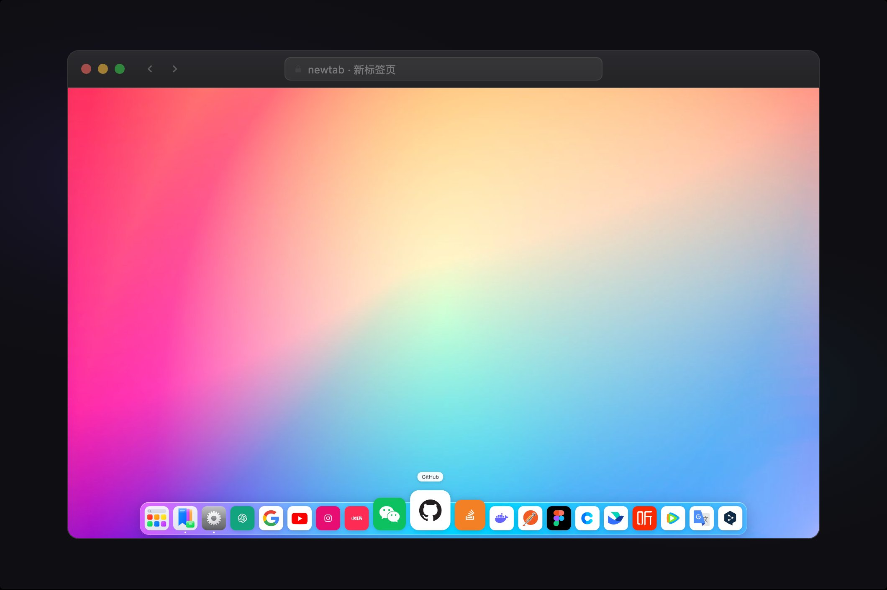
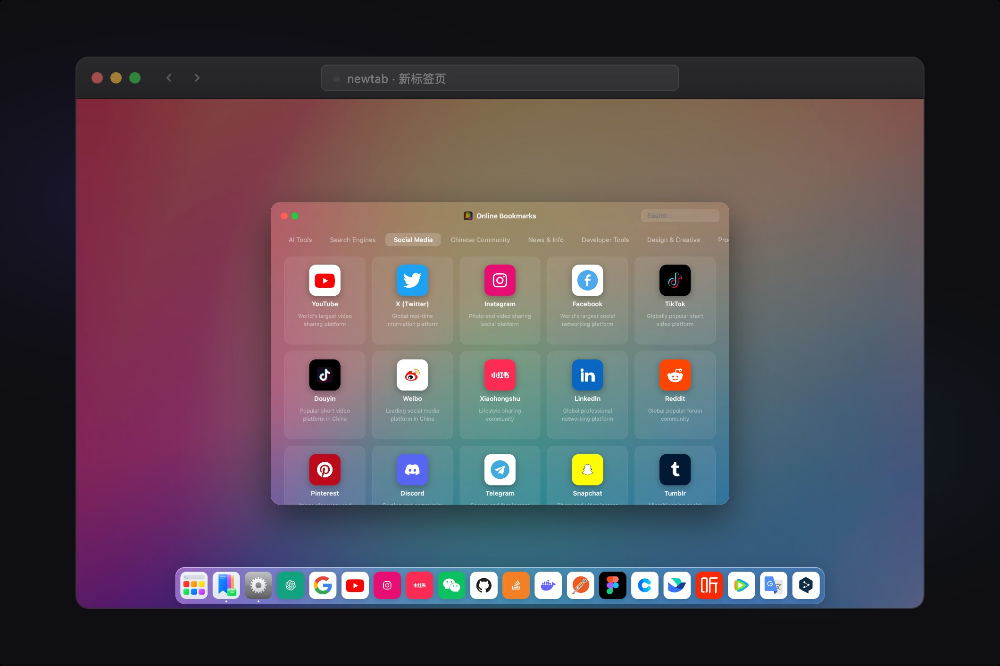
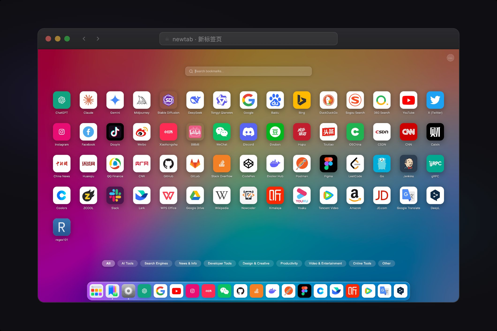
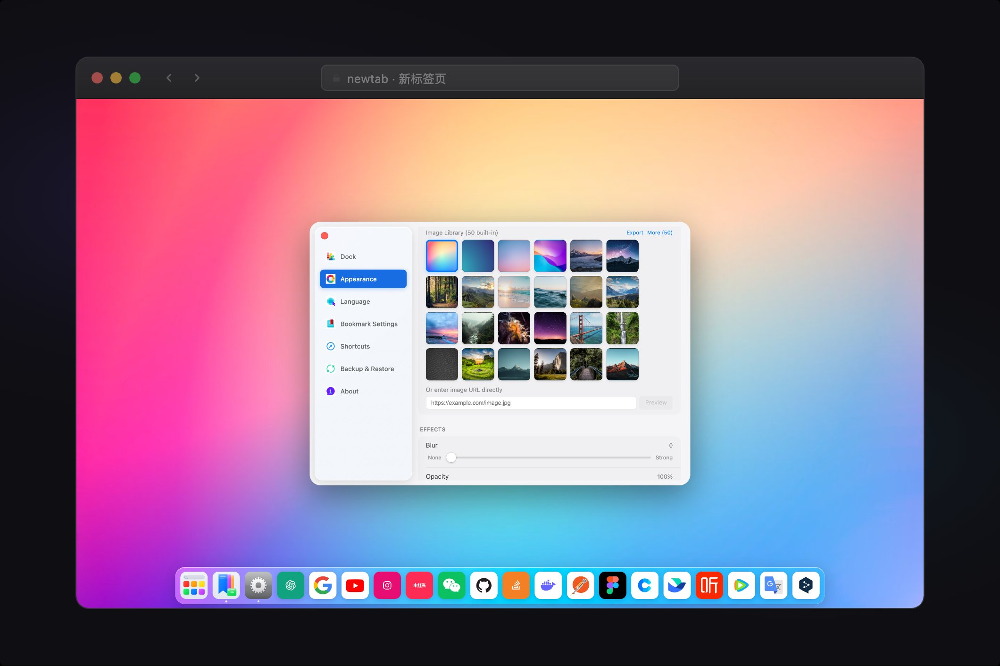
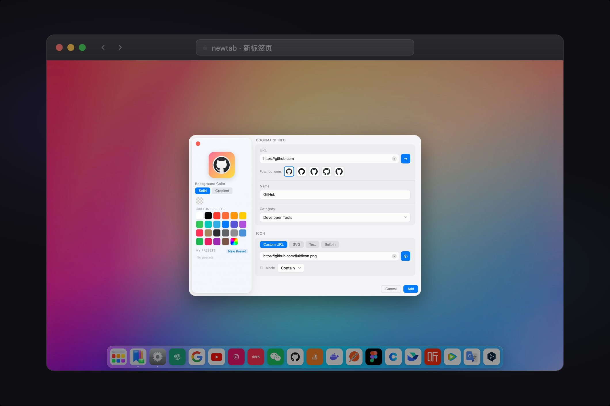

# ✦ NewTab

**새 탭을 열 때마다 새로운 경험을 선사하는 Chrome 확장 프로그램**

[English](./README.md) · [简体中文](./README.zh-CN.md) · [繁體中文](./README.zh-TW.md) · [日本語](./README.ja.md) · 한국어 · [Русский](./README.ru.md)

---

## 스크린샷

<table>
  <tr>
    <td></td>
    <td></td>
  </tr>
  <tr>
    <td></td>
    <td></td>
  </tr>
</table>

---

## 기능

### 🚀 Dock
- 하단·상단·좌측·우측 4가지 위치 지원
- 마우스 호버 시 아이콘 부드럽게 확대 (크기 및 영향 범위 조절 가능)
- 드래그로 순서 변경, 우클릭 컨텍스트 메뉴

### 🔖 북마크 관리
- 4가지 아이콘 유형: 파비콘·SVG·Emoji·텍스트
- 아이콘 배경색 커스텀 (단색 / 그라데이션)
- 카테고리 관리, 그리드 / 리스트 뷰
- 일괄 관리 모드: 다중 선택·일괄 삭제·Dock에 일괄 추가
- `Cmd/Ctrl + D`: 어느 페이지에서나 즉시 북마크, 이미 저장된 경우 자동 알림

### 🖼️ 배경 시스템
- 3가지 유형: 단색·그라데이션·이미지 (URL / API 소스)
- 블러 및 투명도 실시간 조절
- 스케줄 자동 전환 (5분 〜 매월)

### 🔍 검색
- Google·Bing·Baidu·GitHub 등 9개 검색 엔진 내장
- 로컬 북마크 실시간 필터링, 온라인 / 로컬 범위 전환

### 🌐 다국어 지원
简体中文 · 繁體中文 · English · 日本語 · 한국어 · Русский

---

## 설치

### Chrome 웹 스토어에서 설치 (권장)

[Chrome Web Store](https://chrome.google.com/webstore)에서 **NewTab** 을 검색하고 「Chrome에 추가」를 클릭하세요.

### 오프라인 설치

1. [Releases](https://github.com/tabset/newtab/releases)에서 최신 `newtab.zip` 을 다운로드하고 압축 해제.  
   (또는 저장소를 클론하여 직접 빌드: `npm install && npm run build`, 결과물은 `dist` 폴더)
2. Chrome을 열고 주소창에 `chrome://extensions` 입력 후 Enter
3. 우측 상단 **개발자 모드** 활성화
4. 「압축 해제된 확장 프로그램 로드」 클릭 후 압축 해제된 폴더 (또는 `dist`) 선택

---

## 기술 스택

React · TypeScript · Vite · Framer Motion · Manifest V3

---

## License

[MIT](./LICENSE)
