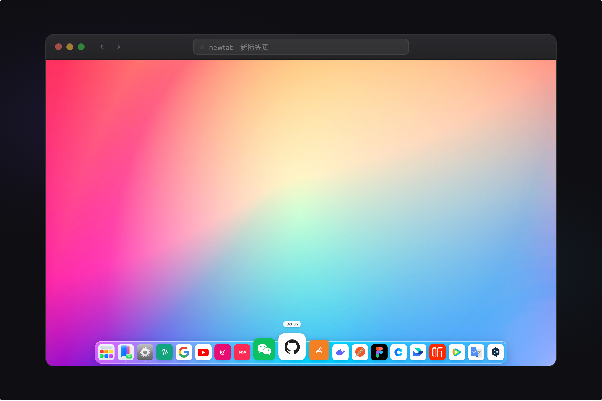
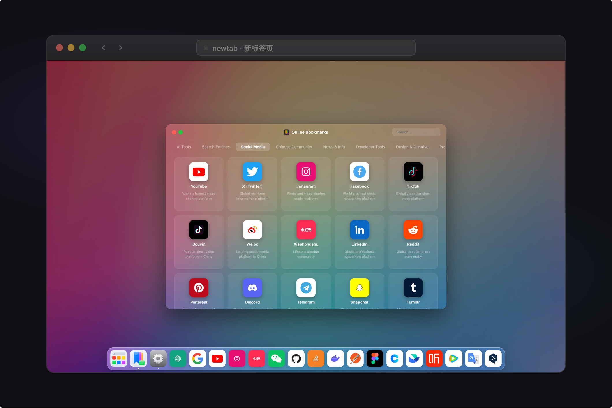
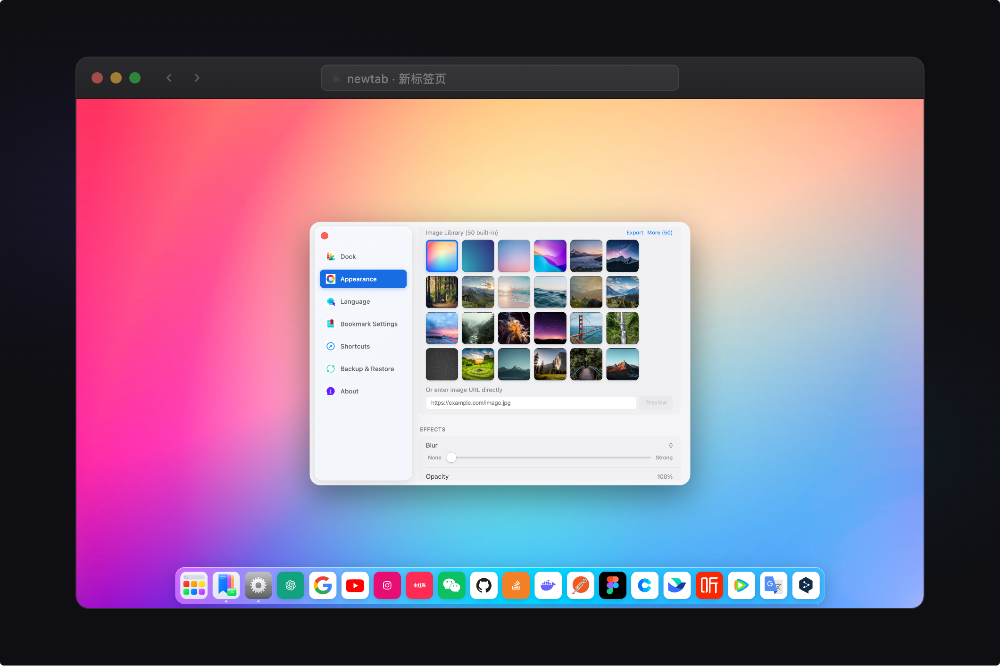
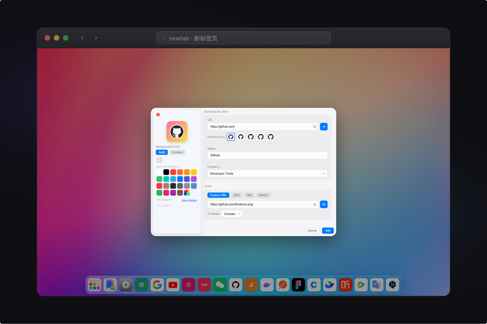

# ✦ NewTab

**一个让每次打开新标签页都焕然一新的 Chrome 扩展**

[English](./README.md) · 简体中文 · [繁體中文](./README.zh-TW.md) · [日本語](./README.ja.md) · [한국어](./README.ko.md) · [Русский](./README.ru.md)

---

## 截图

<table>
  <tr>
    <td></td>
    <td></td>
  </tr>
  <tr>
    <td></td>
    <td></td>
  </tr>
</table>

---

## 功能

### 🚀 Dock 程序坞
- 支持底部、顶部、左侧、右侧四个位置
- 鼠标悬停时图标流畅放大（可调节大小和影响范围）
- 拖拽排序，右键快捷菜单

### 🔖 书签管理
- 4 种图标类型：网站图标、SVG、Emoji、纯文字
- 自定义图标背景色（纯色 / 渐变）
- 支持分类管理，网格 / 列表两种视图
- 批量管理模式：多选、批量删除、批量添加到 Dock
- `Cmd/Ctrl + D`：在任意网页快速收藏当前页面，已收藏时自动提示

### 🖼️ 背景系统
- 三种类型：纯色、渐变、图片（URL / API 数据源）
- 模糊度与透明度实时调节
- 随机切换，支持按时间间隔自动更换（5 分钟 ～ 每月）

### 🔍 搜索
- 内置 Google、Bing、Baidu、GitHub 等 9 个搜索引擎
- 实时过滤本地书签，支持在线 / 本地范围切换

### 🌐 多语言
简体中文 · 繁體中文 · English · 日本語 · 한국어 · Русский

---

## 安装

### 从 Chrome 商店安装（推荐）

在 [Chrome Web Store](https://chrome.google.com/webstore) 搜索 **NewTab** 并点击「添加至 Chrome」。

### 离线安装

1. 前往 [Releases](https://github.com/tabset/newtab/releases) 下载最新的 `newtab.zip`，解压备用。  
   （或克隆仓库自行构建：`npm install && npm run build`，产物在 `dist` 目录）
2. 打开 Chrome，地址栏输入 `chrome://extensions` 并回车
3. 右上角开启**开发者模式**
4. 点击「加载已解压的扩展程序」，选择解压后的文件夹（或 `dist` 目录）

---

## 技术栈

React · TypeScript · Vite · Framer Motion · Manifest V3

---

## License

[MIT](./LICENSE)
